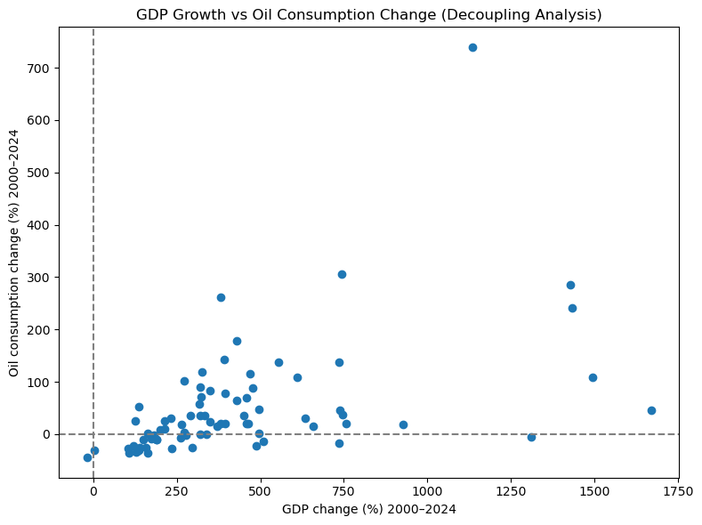
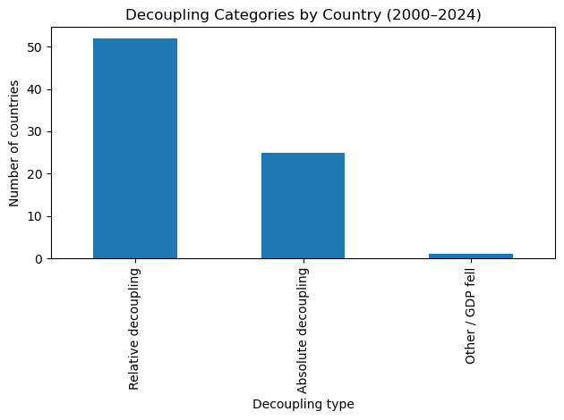
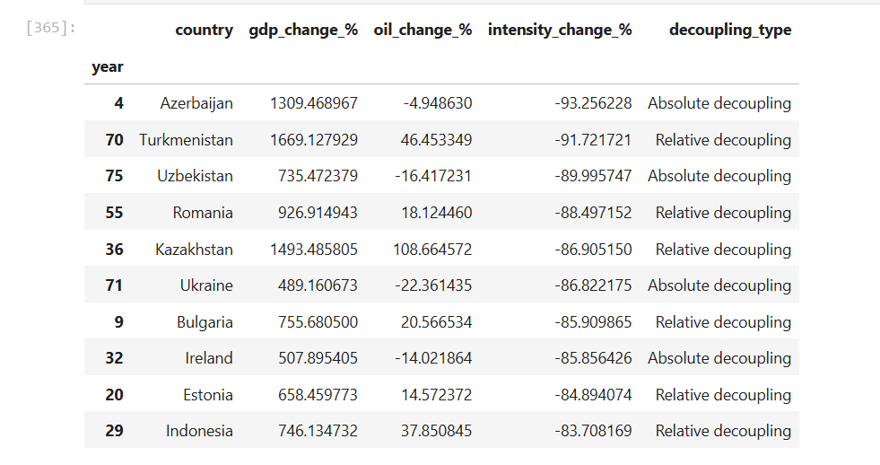

# Are Countries Decoupling Economic Growth from Oil Consumption? (2000–2024)

## 📌 Business Problem

Economic growth has historically been closely tied to fossil fuel consumption. However, as countries pursue energy efficiency, structural transformation, and climate goals, an important question emerges:

**Are countries growing their economies while reducing their dependence on oil?**

This project investigates whether countries are achieving economic decoupling the ability to grow GDP without proportionally increasing oil consumption.

## 🎯 Objective

**To evaluate whether countries between 2000 and 2024 are:**

- Growing economically
- Reducing oil consumption
- Improving oil intensity (oil per unit of GDP)

**The analysis classifies countries into:**
- Absolute Decoupling
- Relative Decoupling
- No Decoupling
- Other / GDP contraction

## 📂 Data Sources
1. Oil Consumption (TWh)
- Source: Our World in Data (OWID)

2. GDP (current US$)
- Source: World Bank API
`Indicator: NY.GDP.MKTP.CD`

**Time period analyzed:**
**2000–2024**

## Tools Used

- Python
- Pandas
- NumPy
- Matplotlib / Seaborn
- World Bank API
- Our World in Data


## 🧹 Data Cleaning & Preparation (Python)

##### The following steps were performed:
- Removed regional aggregates (World, EU, income groups)
- Kept only valid ISO country codes
- Filtered data between 2000–2024
- Merged oil consumption and GDP datasets
- Calculated key indicators:
  - GDP growth (%)
  - Oil consumption growth (%)
  - Oil intensity (TWh per billion USD GDP)
  - Oil intensity change (%)
 
  [View Full Analysis Here](Full_Analysis2/Full_Analysis2.ipynb)

## 📊 Key Metrics Calculated
##### Oil Intensity

```Oil Intensity = Oil Consumption (TWh) / GDP (billion USD)```

This measures how much oil is used per unit of economic output. 

##### Growth Calculations

```wide["gdp_change_%"] = (gdp_2024 / gdp_2000 - 1) * 100```
```wide["oil_change_%"] = (oil_2024 / oil_2000 - 1) * 100```
```wide["intensity_change_%"] = (intensity_2024 / intensity_2000 - 1) * 100```

## Decoupling Classification Logic

#### Countries were classified as follows:

🟢 Absolute Decoupling
- GDP increased
- Oil consumption decreased

🟡 Relative Decoupling
- GDP increased
- Oil consumption increased
- Oil intensity decreased (GDP grew faster than oil use)

🔴 No Decoupling
- GDP increased
- Oil consumption increased faster than GDP

⚫ Other / GDP Fell
- GDP declined over the period

## 📈 Analysis & Visualizations

## 1️⃣ Scatter Plot: GDP Growth vs Oil Consumption Change



**This visualization plots:**
X-axis → GDP growth (%)

Y-axis → Oil consumption change (%)


**Key Observations**

**The scatter plot compares how much each country’s economy grew (x-axis) against how much its oil consumption changed (y-axis) between 2000 and 2024.**

**Most countries sit in the top-right quadrant, meaning GDP increased and oil consumption also increased.**

**However, the fact that these countries were still classified as relative decoupling indicates that, for many of them, GDP grew faster than oil consumption, so oil intensity declined.**

**A sizeable group appears in the bottom-right quadrant (GDP up, oil down). These are the absolute decoupling countries—economies that expanded while reducing oil use, which is the clearest sign of structural decoupling.**

**The chart also shows a few countries far to the right with very high GDP growth. Some of these also show large oil increases, suggesting that rapid economic expansion can still be accompanied by rising oil demand in certain contexts. Overall, the scatter confirms that economic growth does not automatically require proportional growth in oil consumption, but the pathway differs across countries.**


**High-growth economies often show oil demand increases, but many exhibit relative decoupling**


## 2️⃣ Decoupling Classification Distribution



**The classification breakdown shows:**

**The bar chart summarizes how countries are distributed across decoupling categories.**

**Out of 78 countries, relative decoupling dominates (52 countries), showing that the most common pattern is: GDP growth continues while oil consumption rises more slowly, resulting in a decline in oil intensity.** 

**A strong minority achieved absolute decoupling (25 countries), meaning GDP grew while oil consumption fell.**

**Only one country falls into the “Other / GDP fell” category, indicating that most countries in the dataset experienced overall economic growth during the period.**

**This distribution supports the conclusion that decoupling is widespread, but in most cases it is still efficiency-led (relative) rather than driven by a full reduction in oil use (absolute). The presence of a substantial absolute decoupling group, however, shows that reductions in oil consumption alongside growth are achievable in practice.**

**This suggests gradual structural improvement in oil efficiency globally.**

## 3️⃣ Top 10 largest reductions in oil intensity (best decouplers)




**The table ranks countries by the greatest decline in oil intensity (oil consumption per $1B GDP), highlighting the strongest improvement in “economic output per unit of oil.”**

**Countries at the top of this list achieved very large reductions in intensity (roughly 80–93% declines), meaning they now generate much more GDP for every unit of oil consumed compared to 2000.**

**The table also shows that strong intensity improvements can happen under both decoupling types. Some top performers fall under absolute decoupling (GDP up, oil down), indicating a genuine reduction in oil dependence.**

**Others fall under relative decoupling (GDP up, oil also up), showing that even where oil demand increased, economies still became substantially more efficient because GDP expanded faster than oil consumption. Overall, the table provides clear “best performer” examples to spotlight in reporting and to use as benchmarks for countries seeking to reduce oil dependence while maintaining growth.**
 
## Overall Findings

1. Most countries are not fully separating growth from oil use, but many are improving efficiency.
2. Absolute decoupling remains concentrated in advanced economies.
3. Relative decoupling is widespread - GDP is growing faster than oil consumption.
4. Oil intensity has declined in many economies over the past two decades.
5. Emerging economies still show stronger oil-demand growth relative to GDP.


## Limitations

**1. GDP measured in current USD may be influenced by inflation and exchange rates.**

**2. The analysis does not control for:**
- Population growth
- Structural industrial changes
- Energy mix transitions (renewables)

**3. Oil consumption measured in TWh does not capture total energy dependency.**

**4. The period includes structural shocks (2008 crisis, COVID-19) that may distort long-run trends.**

**5. Data availability varies across countries.**

## Conclusion

Between 2000 and 2024, global evidence suggests a gradual shift toward oil-use efficiency.

While complete decoupling remains limited, many economies are achieving relative decoupling, meaning economic growth is outpacing oil demand growth.

Absolute decoupling is more visible in advanced economies, while developing nations continue to experience oil demand expansion alongside growth.

The findings indicate progress toward efficiency but highlight ongoing structural reliance on oil in many regions.

**Understanding decoupling patterns is essential for:**

- Climate transition policy
- Energy market forecasting
- Long-term demand projections
- Sustainable growth strategy
